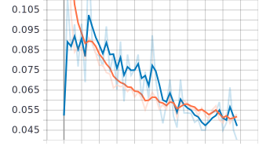
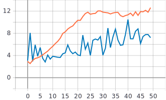
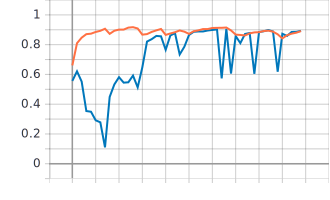
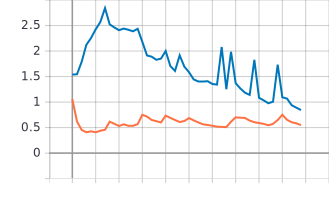

# С использованием примера [2] обучить нейронную сеть EfficientNet-B0 [3,4,5] (случайное начальное приближение) для решения задачи классификации изображений Oregon WildLife [6]
Для решения задачи классификации изображений Oregon Wildlife использовалась нейронная сеть EfficientNet-B0. Причем данная нейронная сеть будет со случайным начальным приближением, а это значит, что веса нашей неройронной сети не будут предобученными, а будут случайными.  
* Размерность входного изображения (224x224x3):  
```
inputs = tf.keras.Input(shape=(RESIZE_TO, RESIZE_TO, 3))
```  
* Будем использовать нейронную сеть EfficientNet-B0:
```
outputs = EfficientNetB0(include_top=True,weights=None, classes = NUM_CLASSES)(inputs)
```
Параметр weights отвечает за наши веса, а именно будут они предобученными или случайными. Поэтому для данного случая weigths = None (случайное начальное приближение). Параметр include_top = True означает, что мы будет использовать (верхние) слои нейронной сети EfficientNet-B0, которые отвечают за классификацию. Таким образом используется классификатор нейронной сети EfficientNet-B0 для классификации изображений Oregon wildlife, чтобы узнать к какой из 20 возможных категорий (classes = NUM_CLASSES) входное изображение относится.  
***  
### В результате обучения нейронной сети EfficientNet-B0 со случайным начальным приближением получили следующие графики:  
Синяя линия - на валидации  
Оранжевая линия - на обучении  
* График метрики точности для нейронной сети EfficientNet-B0 (случайное начальное приближение):  


* График функции потерь для нейронной сети EfficientNet-B0 (случайное начальное приближение):  



* Анализ полученных результатов  
Исходя из полученных результатов можно отметить следующее: Во-первых точность как на тренировочном, так и на валидационном наборе данных низкая (максимум 11 процентов) и с каждой эпохой метрика точности уменьшается, а потери увеличиваются. Можно сделать вывод, что сеть не обучается вовсе (возможно слишком высокий темп обучения). Также график метрики точности и график потерь на валидационном наборе данным получился "изрезанным" и может наблюдаться следующее: значение метрики точности на валидационном наборе данных начинает возрастать, в то время как значение функции потерь на тренировочном наборе данных продолжает снижаться. Таким образом в некоторые моменты значение функции потерь на валидационном наборе данных сильно отличается от значения функции потерь на тренировочном наборе данных. Аналогичная ситуация и со значениями метрики качества. 
# С использованием [2] и техники обучения Transfer Learning [7] обучить нейронную сеть EfficientNet-B0 (предобученную на базе изображений imagenet) для решения задачи классификации изображений Oregon WildLife  
***  
Техника Transfer Learning предполагает использование предварительно обученной нейронной сети для решения других задач.  
***  
В данной части лабораторной работы по-прежнему использовалась нейронная сеть EfficientNet-B0, однако в данном случае нейронная сеть будет иметь уже предобученные веса на базе изображений ImageNet. Для того, чтобы наши веса были предобученными на базе изображений ImageNet, необходимо параметр weights выставить равным "imagenet":
```
model = EfficientNetB0(include_top=False, input_tensor=inputs, pooling='avg', weights='imagenet')(inputs) 
```
Также важным параметром является include_top, так как датасет (ImageNet) включает в себя набор из 1.4 миллиона картинок распределенных на 1000 классов, однако задача нашей нейронной сети заключается в классификации 12000 изображений дикой природы Oregon Wildlife распределенных на 20 классов. Соответственно нас не интересует та часть нейронной сети EfficientNet-B0, которая отвечает за классификацию изображений ImageNet. Поэтому параметр include_top будет равен False. Таким образом остается лишь та часть нейронной сети, которая отвечает за выделение характерных признаков в изображении, а сам классификатор убирается. pooling = 'avg' означает, что глобальное среднее объединение будет применено к выходным данным последнего сверточного слоя, таким образом, выходом модели будет двухмерный тензор.   
*** 
Так как та часть нейронной сети EfficientNet-B0, которая отвечает за выделение каких-то характерных признаков в изображении уже обучена, то мы можем "заморозить" данную часть и не обучать её, а будет обучаться только классификатор (нейронная сеть будет использоваться в качестве средства извлечения признаков, но не для классификации):
```
model.trainable = False
```
Далее состовляется собственный классификатор (выходные слои нейронной сети):  
```
outputs = tf.keras.layers.Dense(NUM_CLASSES, activation = tf.keras.activations.softmax)(model)
```
Полносвязный Dense слой (выходной слой) в котором и определяется к какому классу (категории) из 20 возможных будет относится поданное на вход изображение, а именно функция активации softmax даст определенную вероятность того, что поданное на вход изображение относится к определенному классу (из 20 возможных).
### В результате обучения нейронной сети EfficientNet-B0 с предобученными весами на базе imagenet получили следующие графики:  
Синяя линия - на валидации  
Оранжевая линия - на обучении  
* График метрики точности для нейронной сети EfficientNet-B0 (предобученные веса):  


* График функции потерь для нейронной сети EfficientNet-B0 (предобученные веса):  

  

* Анализ полученных результатов  
Для начала можно отметить, что результаты предобученной нейронной сети намного лучше, чем результаты нейронной сети со случайным приближением. Во-первых: значения метрики точности выше на протяжении всего обучения (около 80-90 процентов на тренировочном наборе данных), в то время как значение потерь уменьшается на протяжении всего обучения как на валидационном, так и на тренировочном наборе данных (сеть обучается, чего не было в случае со случайным приближением). На протяжении обучения значения точности на валидационным наборе данных приближается к значениям на тренировочном наборе данных и в конце обучения состовляет около 90 процентов, хоть и на протяжении обучения в некоторые моменты наблюдается разброс между точностью на валидационном наборе данных, например: 60 процентов - на валидационном, а на тренировочном около 85-90 процентов. Похожая ситуация и с графиками функций потерь. Таким образом результат нейронной сети с предобученными весами на базе более большого датасета ImageNet лучше, чем результат нейронной сети со случайным приближением.
